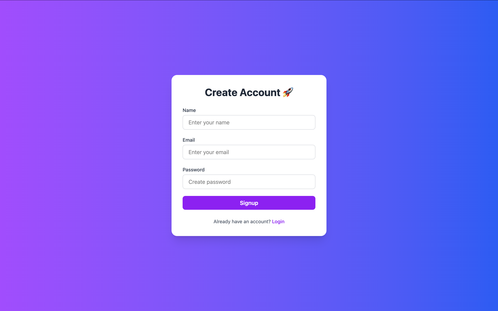
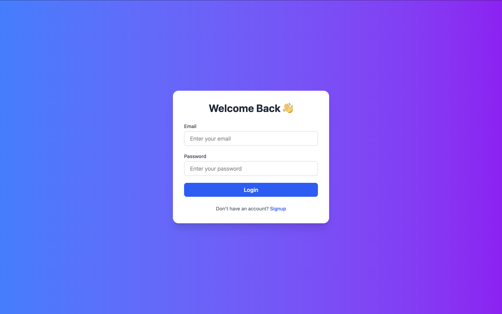
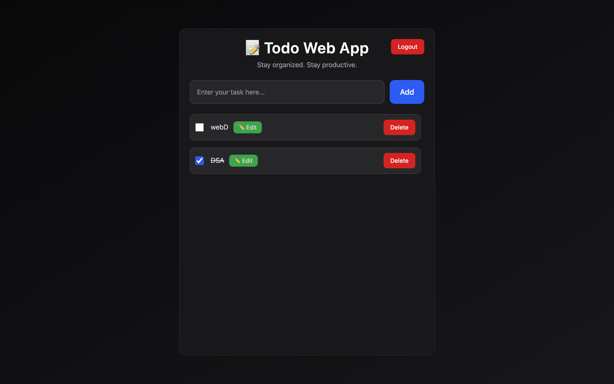

# 📝 FullStack Todo Application

**JWT Authentication • Multi-User Support • Protected Routes**

A production-style **FullStack Todo Application** built using **React, Node.js, Express, and MongoDB**.  
This project was developed step-by-step in structured phases to simulate real-world engineering workflows and industry practices.

---

# 🚀 Tech Stack

## Frontend

- React.js  
- React Router DOM  
- TailwindCSS  
- Axios  

## Backend

- Node.js  
- Express.js  
- MongoDB  
- Mongoose  
- JWT Authentication  
- Cookie-based Authentication  
- dotenv  

---

# 🔐 Core Features

✔ User Signup & Login  
✔ JWT Authentication using HTTP-only Cookies  
✔ Protected Backend Routes  
✔ Protected Frontend Navigation  
✔ Multi-user Todo Management  
✔ Add / Update / Delete Tasks  
✔ Toggle Task Completion  
✔ Logout Functionality  
✔ Loading State Handling  
✔ Environment Variable Configuration  
✔ Industry-standard MVC Architecture  

---

# 📌 Development Timeline (Phase-wise)

This project was built incrementally through multiple phases, each introducing new functionality and improvements.

---

# 🔵 Initial Setup

## Initial Commit

✔ Repository initialized  
✔ Git version control setup  

---

# 🟢 Phase 1 — FullStack Todo App

## Phase 1.1 — Backend Setup Completed

✔ Express server initialized  
✔ Middleware setup  
✔ MongoDB connection established  

---

## Phase 1.2 — Created Task Schema

✔ Designed Task schema using Mongoose  

Fields:

- title  
- completed status  
- timestamps  

---

## Phase 1.3 — Implemented CRUD APIs

✔ Created REST APIs:

```
GET /tasks  
POST /tasks  
PUT /tasks/:id  
DELETE /tasks/:id  
PATCH /tasks/:id  
```

✔ Implemented error handling  
✔ Tested multiple edge cases  

---

## Phase 1.4 — React Frontend Setup

✔ React application initialized  
✔ Basic UI layout created  

---

## Phase 1.5 — Add Task Functionality

✔ Implemented Add Task logic  
✔ Used React state management  

---

## Phase 1.6 — Complete Todo Frontend UI

✔ Built UI for:

- Add Task  
- Update Task  
- Delete Task  
- Toggle Completion  

✔ Connected frontend with backend APIs  

---

## ✅ Phase 1 Completed

✔ Single-file FullStack Todo app fully working  

---

# 🟣 Phase 2 — Code Refactoring

## Phase 2.1 — Backend Refactored (MVC Architecture)

Backend converted into industry-standard folder structure:

```
models/
routes/
controllers/
config/
```

Benefits:

✔ Better maintainability  
✔ Scalable architecture  
✔ Cleaner code structure  

---

## Phase 2.2 — Frontend Refactored

✔ Separated UI into reusable components  
✔ Created dedicated API service layer  
✔ Improved component structure  

---

# 🔴 Phase 3 — Authentication System

## Phase 3.1 — Created User Model

✔ User schema implemented  
✔ Added validation improvements  

Fields:

```
name  
email  
password  
```

✔ Password hashing implemented  

---

## Phase 3.2 — Signup & Login with JWT

✔ User Signup implemented  
✔ Login authentication added  
✔ JWT token generation configured  

### Authentication Flow

```
User Login
      ↓
Verify credentials
      ↓
Generate JWT
      ↓
Send token
```

---

## Phase 3.3 — Authentication Middleware

✔ Created auth middleware  
✔ Protected Todo routes  
✔ Verified token before accessing data  
✔ Tested routes using Postman  

**Result:** Only authenticated users can access Todos  

---

## Phase 3.4 — Frontend Auth Integration

✔ Created Signup Page  
✔ Created Login Page  
✔ Connected frontend forms with backend  
✔ Implemented navigation after login  

Enabled:

- User-based routing  
- Multi-user Todo separation  

---

## Phase 3.5 — Logout Feature

✔ Added Logout button  
✔ Implemented logout API  
✔ Cleared authentication cookies  
✔ Redirected user to Login page  

### Logout Flow

```
User clicks Logout
        ↓
Cookie cleared
        ↓
User redirected to Login
```

---

## Phase 3.6 — Loading State + Environment Variables

✔ Added loading indicator while fetching Todos  
✔ Implemented `.env` configuration  
✔ Moved sensitive data to environment variables  

Configured:

```
PORT  
MONGO_URI  
JWT_SECRET  
```

✔ Integrated dotenv  
✔ Improved security practices  

---

# 🔐 Authentication Architecture

```
User Login
        ↓
Backend verifies credentials
        ↓
JWT Token generated
        ↓
Token stored in HTTP-only cookie
        ↓
Protected routes verify token
        ↓
User-specific Todos returned
```

---

# 📂 Folder Structure

```
Todo-App/

backend/
├── config/
├── controllers/
├── middleware/
├── models/
├── routes/
├── .env
├── app.js
└── package.json

frontend/
├── src/
│   ├── components/
│   ├── pages/
│   ├── services/
│   ├── App.jsx
│   └── main.jsx
├── index.html
└── package.json
```

---

# ⚙️ Environment Setup

Create `.env` inside backend:

```
PORT=3000
MONGO_URI=mongodb://127.0.0.1:27017/todoDB
JWT_SECRET=yourSecretKey
```

---

# ▶️ Run Locally

## Clone Repo

```
git clone https://github.com/Jatin915/FullStack-AI-Practice-Projects.git
cd Todo-App
```

---

## Backend Setup

```
cd backend
npm install
npm start
```

---

## Frontend Setup

```
cd frontend
npm install
npm run dev
```

---

# 🎯 Learning Outcomes

This project helped in understanding:

✔ FullStack architecture  
✔ REST API design  
✔ JWT authentication  
✔ Cookie-based session handling  
✔ Protected routes  
✔ Middleware implementation  
✔ Frontend-backend integration  
✔ Component-based architecture  
✔ Error handling  
✔ Environment variable security  
✔ Production-style development workflow  

---

# 👨‍💻 Project Purpose

This project was developed as part of a structured FullStack learning journey, focusing on building real-world scalable applications instead of tutorial-based implementations.

---

# 📸 Screenshots

## Signup Page


## Login Page


## Todo Dashboard
